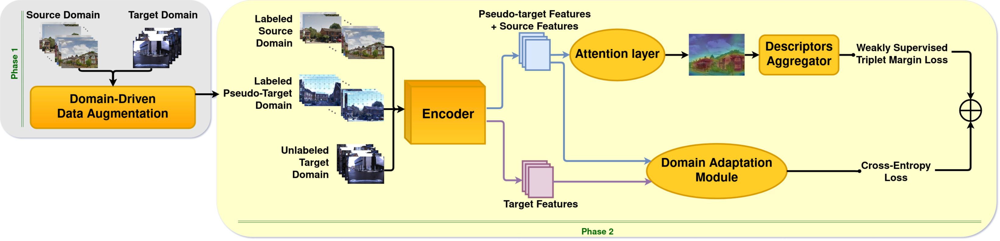

# AdAGeo: Adaptive-Attentive Geolocalization from few queries: a hybrid approach
Pytorch code of AdAGeo - WACV2021

Arxiv paper: https://arxiv.org/abs/2010.06897 accepted at WACV2021

Requirements:
*  Python 3.4+
*  Pip3
*  `pip3 install -r *requirements.txt*`
  
  
Datasets and ResNet18-based AdAGeo are available on request.
Datasets details are provided in *datasets_details.txt*.

Please, set the parameter `--allDatasetsPath` in **const.py** before starting. It is the root path (hardcoded) where *oxford60k* is located.  

Train model for a certain target SCENARIO:  
*  Phase 1:  
*  Phase 2: Training starting from ResNet18 pretrained on Places365 (code already provides model/weights downloading from project https://github.com/CSAILVision/places365) with default parameters set to the ones declared in our paper.  
Using our dataset paths management, you only need to decide the SCENARIO (int value) of Oxford RobotCar dataset and run the command below.  
`python main.py --expName={what you want} --attention --trainQ=train/queries__queries_biost_few_{SCENARIO} --valQ=val/queries_biost_few_{SCENARIO} --testQ=test/queries_{SCENARIO} --grl --grlDatasets=train/queries+train/queries_biost_few_{SCENARIO}+train/queries_n5_d{SCENARIO} --epochDivider=4 --patience=3 `  
  
Test model for a certain target SCENARIO:  
`python eval.py --expName=<what you want> --resume=<path to trained model> --ckpt=best --attention --testQ=test/queries_{SCENARIO}`  
  

@misc{berton2020adaptiveattentive,
    title={Adaptive-Attentive Geolocalization from few queries: a hybrid approach},
    author={Gabriele Moreno Berton and Valerio Paolicelli and Carlo Masone and Barbara Caputo},
    year={2020},
    eprint={2010.06897},
    archivePrefix={arXiv},
    primaryClass={cs.CV}
}
